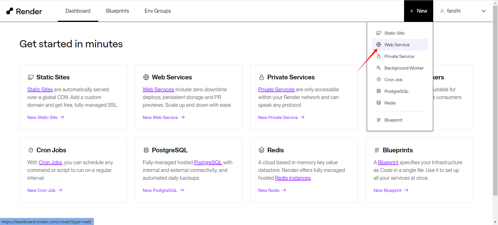
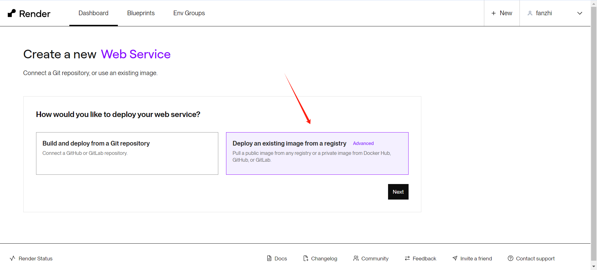
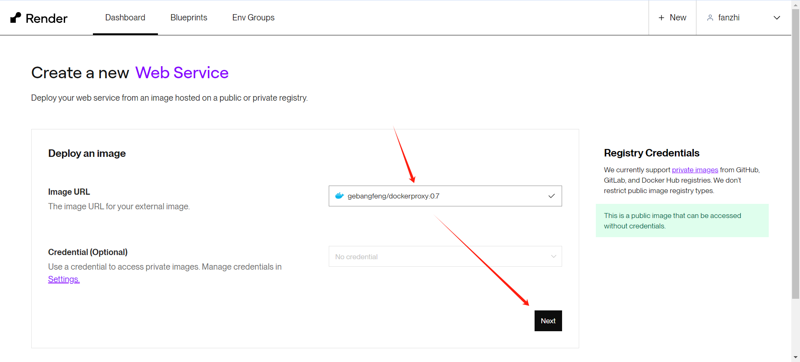
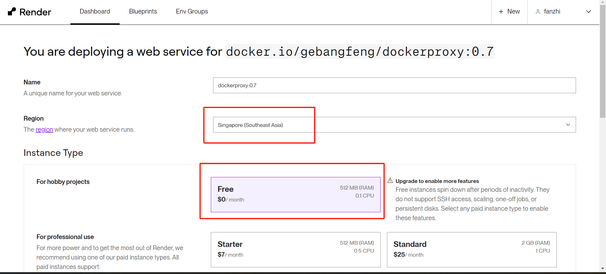
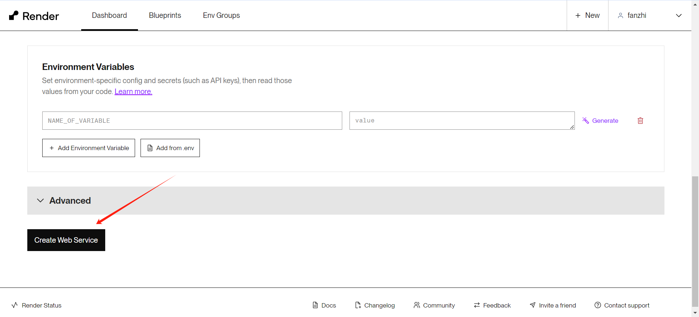
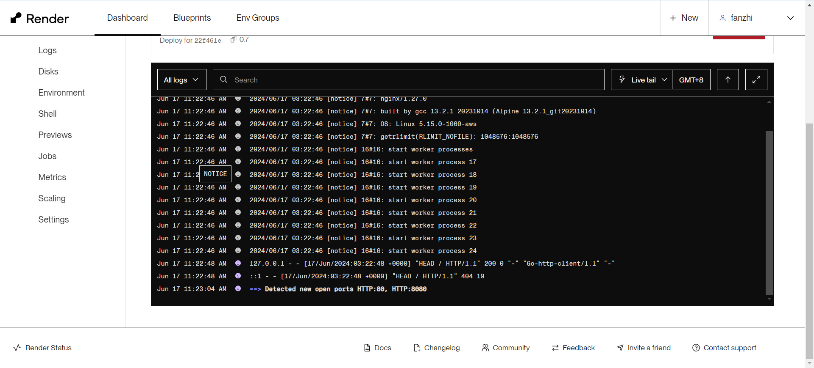
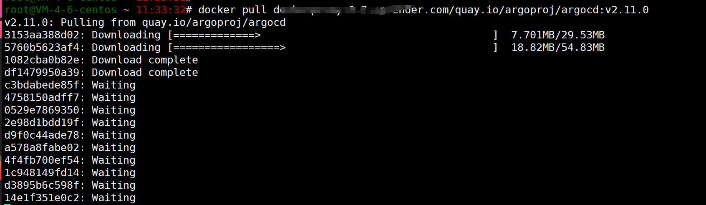

<div align="center">

# docker-proxy

[](https://github.com/kubesre)
[](https://github.com/kubesre/docker-registry-mirrors/graphs/contributors)
[](https://github.com/kubesre/docker-registry-mirrors/issues)
[](https://github.com/kubesre/docker-registry-mirrors/pulls)
[](https://github.com/kubesre/docker-registry-mirrors/stargazers)
[](https://github.com/kubesre/docker-registry-mirrors)
[](https://github.com/kubesre/docker-registry-mirrors/blob/main/LICENSE)

<p> 使用 Render 快速部署自建的Docker镜像加速服务.</p>

</div>


## 📦 部署
**1. 登入 [Render](https://dashboard.render.com)**

**2. 创建我们的服务**
<table>
    <tr>
        <td width="50%" align="center"></td>
    </tr>
</table>

**3. 选择以docker容器的方式部署，输入镜像地址`gebangfeng/dockerproxy:0.7` 然后点击Next**
  
<table>
    <tr>
        <td width="50%" align="center"></td>
    </tr>
</table>

<table>
    <tr>
        <td width="50%" align="center"></td>
    </tr>
</table>

**4. 部署区域可以选择`Singapore(新加坡)`，实例类型选择免费即可(免费实例需要保活,可使用 [uptime-kuma](https://uptime.kuma.pet/) 或 [D监控](https://www.dnspod.cn/Products/Monitor) 实现)**

<table>
    <tr>
        <td width="50%" align="center"></td>
    </tr>
</table>

**5. 环境变量不用添加，直接选择创建即可**
<table>
    <tr>
        <td width="50%" align="center"></td>
    </tr>
</table>

**6. 等待服务运行完成之后，使用分配的外网域名即可愉快的使用了**
<table>
    <tr>
        <td width="50%" align="center"></td>
    </tr>
</table>
<table>
    <tr>
        <td width="50%" align="center"></td>
    </tr>
</table>

## ✨ 使用

**1. 使用Render服务地址，增加前缀的方式拉取镜像(以下只是举例，实际支持所有常用仓库)**

```shell
# docker hub Registry
## 源：nginx:alpine
## 替换
docker pull your_render_url/docker.io/nginx:alpine

# quay.io
## 源：quay.io/argoproj/argocd:v2.11.0
## 替换
docker pull your_render_url/quay.io/argoproj/argocd:v2.11.0
```

**3. 拉取速度测试，效果还是可以的，主要是免费**



## ⚠️ 注意
**1.** 免费实例如果15分钟内未收到入站流量，Render会关闭实例的网络服务。Render 会在下次收到处理请求时重新启动该服务。

**2.** Render每月为每个用户和团队提供 750 小时的免费实例时间：
   - 免费网络服务在运行期间会消耗这些时间（停止服务不要消耗免费实例
   - 小时数）。
   - 如果您在某个月内用完了所有免费实例小时数，Render将暂停您的所有免费网络服务，直到下个月开始。
   - 每个月开始时，您的免费实例小时数将重置为 750 小时（剩余小时数不会结转）。

**3.** 最好自己个人使用或者小团队使用，如果你的服务使用人多了，Render照样会把你的服务给删除掉，并且没有任何提醒！

## 感谢以下项目的付出

- [crproxy](https://github.com/wzshiming/crproxy/tree/master/examples/default)
- [Docker-Proxy](https://github.com/dqzboy/Docker-Proxy)